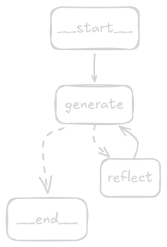

# Reflection Agent

A LangGraph-based agent that iteratively improves Twitter posts through a generate → reflect loop. The agent uses two LLM chains — one to write tweets and one to critique them — cycling until the output meets quality expectations.

## Architecture



The agent is built as a `StateGraph` with two nodes:

```
__start__ → generate → reflect → generate → ... → __end__
```

- **generate**: A tweet-writing assistant that produces or revises a post based on the current message history.
- **reflect**: A viral Twitter influencer persona that critiques the tweet and provides detailed recommendations (length, virality, style, etc.).
- The loop continues until the message history exceeds 6 messages, at which point the graph exits.

The reflection node wraps its critique as a `HumanMessage` so it feeds back into the generator as user input, creating a natural revision cycle.

## How It Works

1. The user provides a tweet to improve.
2. The `generate` node produces an improved version.
3. The `reflect` node critiques it and suggests changes.
4. The critique is fed back to `generate` as a new human message.
5. Steps 2–4 repeat until `len(messages) > 6`, then the graph ends.

Both chains use [OpenRouter](https://openrouter.ai/) as the LLM backend via the `langchain-openai` integration with a custom `base_url`.

## Setup

**Prerequisites:** Python 3.13+, [`uv`](https://docs.astral.sh/uv/)

```bash
git clone <repo-url>
cd langchain-training
uv sync
```

Copy the environment template and fill in your keys:

```bash
cp .env.example .env
```

Required environment variables:

| Variable | Description |
|---|---|
| `OPENROUTER_API_KEY` | Your [OpenRouter](https://openrouter.ai/) API key |
| `OPENROUTER_GENERATIVE_MODEL` | Model slug, e.g. `nvidia/nemotron-3-nano-30b-a3b:free` |
| `OPENROUTER_GENERATIVE_URL` | OpenRouter base URL: `https://openrouter.ai/api/v1` |
| `LANGSMITH_API_KEY` | (Optional) [LangSmith](https://smith.langchain.com/) key for tracing |
| `LANGSMITH_ENDPOINT` | (Optional) LangSmith endpoint, e.g. `https://eu.api.smith.langchain.com` |
| `LANGSMITH_PROJECT` | (Optional) Project name for tracing |

## Running

```bash
uv run python main.py
```

The agent will run the reflection loop on a hardcoded sample tweet and print the final message history. To use your own tweet, edit the `input_messages` in `main.py`:

```python
input_messages = HumanMessage(content="Make this tweet better: <your tweet here>")
```

## Key Dependencies

| Package | Purpose |
|---|---|
| `langgraph` | Graph-based agent orchestration |
| `langchain` | Core LangChain framework |
| `langchain-openai` | OpenAI-compatible LLM client (used for OpenRouter) |
| `langsmith` | Tracing and observability |
| `python-dotenv` | `.env` file loading |
